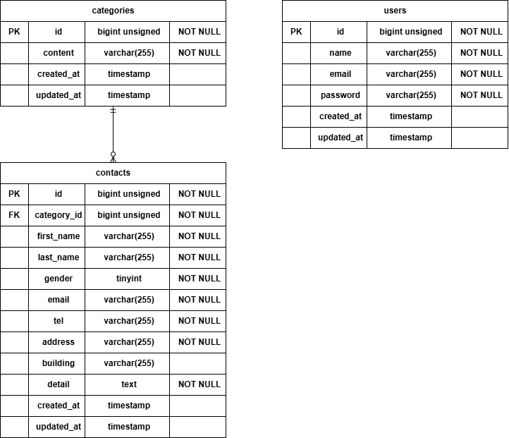

# お問い合わせフォーム

## 環境構築

### Docker ビルド

```bash
git clone https://github.com/YUROSE224/contact-form-app.git
cd contact-form-app
docker compose up -d --build
```

### Laravel 環境構築

```bash
docker compose exec php bash
composer install
cp .env.example .env
php artisan key:generate
php artisan migrate
php artisan db:seed
```

## 使用技術(実行環境)

- PHP 8.1.34
- Laravel 8.83.29
- MySQL 8.0.26
- nginx 1.21.1
- Docker 28.3.3（自分の使用環境）

## ER 図



## URL

- 開発環境: http://localhost
- phpMyAdmin: http://localhost:8080
